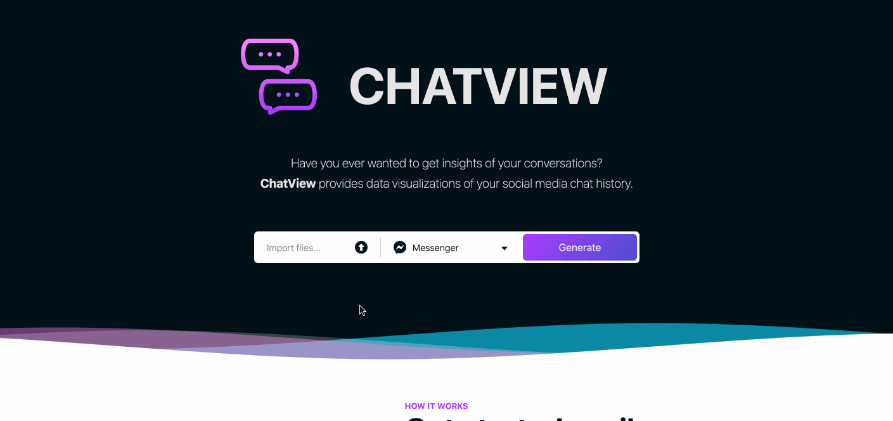

# ChatView

Web app that generates reports on social media chat history, such as **Messenger**, **Whatsapp**, **Instagram** and **Telegram**.

<p align="center">
	
</p>

Once downloaded, you'll get a report similar to [this one](docs/chat-report.png).

## 🚀 Setup

### Docker 

1. Clone/Download the repository
2. Make sure you have [Docker](https://www.docker.com/) installed in your machine
3. From the `terminal`, `cd` to the root of the project and run:

```
docker-compose up
```

Once the containers are up, open your browser and run the web app hosted at [http://localhost:3000](http://localhost:3000).

### Local

#### Server

Follow the [README](./server/README.md) in the server module.

#### Client

Once you get the server up and running, it's time to run the client app. You can do so by following the [README](./client/README.md) in the client module. 

Similarly to the [Docker setup](#Docker), you can now open your browser and run the web app hosted at [http://localhost:3000](http://localhost:3000)

## 🗒 Roadmap

### Client

* Responsive UI
* Add more report customizations:
    * Color scheme
    * Change titles and labels
    * Override participant names
    * Add/hide sections (e.g. Emojis, Participant Messages)
		* New data section analytics
* Handle group chat history reports
    * Extend current sections to be able to handle group chats
* Improve error handling

### Server

* Implement Whatsapp, Instagram and Telegram chat handlers
* Add more chat analytics
* Improve error handling

## 🎗 Donate

If you like the project and want to support further development, consider sending a tip ❤️       

* Crypto asset:  
**Ethereum** (or any other crypto asset) either via [CryptoRequest](https://cryptorequest.finance/#/pay/?req=eyJ2ZXJzaW9uIjoiMS4wLjAiLCJhbW91bnQiOiIiLCJpc1RpcCI6dHJ1ZSwicmVjZWl2ZXIiOiIweGYyMTUxMjZBMjc2NmZGZjdCNzNjRGMxNkE4MWI5RGI2ODFmMDMyRUEiLCJjaGFpbklkIjoiMSIsImlzVG9rZW4iOmZhbHNlLCJhc3NldEFkZHJlc3MiOiIweDAwMDAwMDAwMDAwMDAwMDAwMDAwMDAwMDAwMDAwMDAwMDAwMDAwMDAiLCJzeW1ib2wiOiJFVEgiLCJ0aXRsZSI6IiVGMCU5RiU4RSU5NyUyMFRpcCUyMENoYXRWaWV3JTIwbnBtJTIwcGFja2FnZSUyMCVGMCU5RiU4RSU5NyJ9) or directly to my wallet address `0xf215126A2766fFf7B73cDc16A81b9Db681f032EA`

* A humble mug of coffee:  
<a href="https://www.buymeacoffee.com/vitorcodes" target="_blank"></a>
